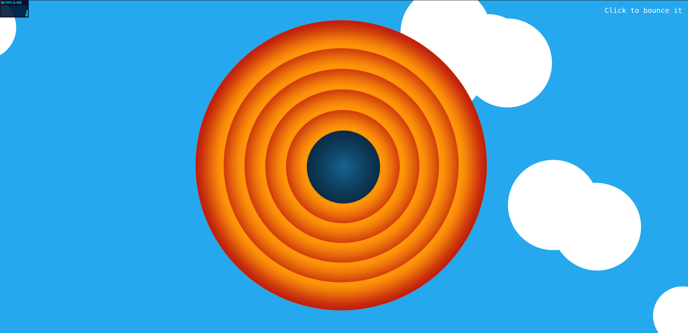

# Looney Tunes Dominique Engine Example

## How to run

Using node version 18.19.1

```bash
npm install
```

```bash
npm run dev
```

## Featuring:

- Resize
- Request animation frame render
- Stats.js
- WebGl from scratch
- SDF (Signed Distance Field) rendering
- Shader toy example wannabe



## TODO
Improve random generation of the clouds
